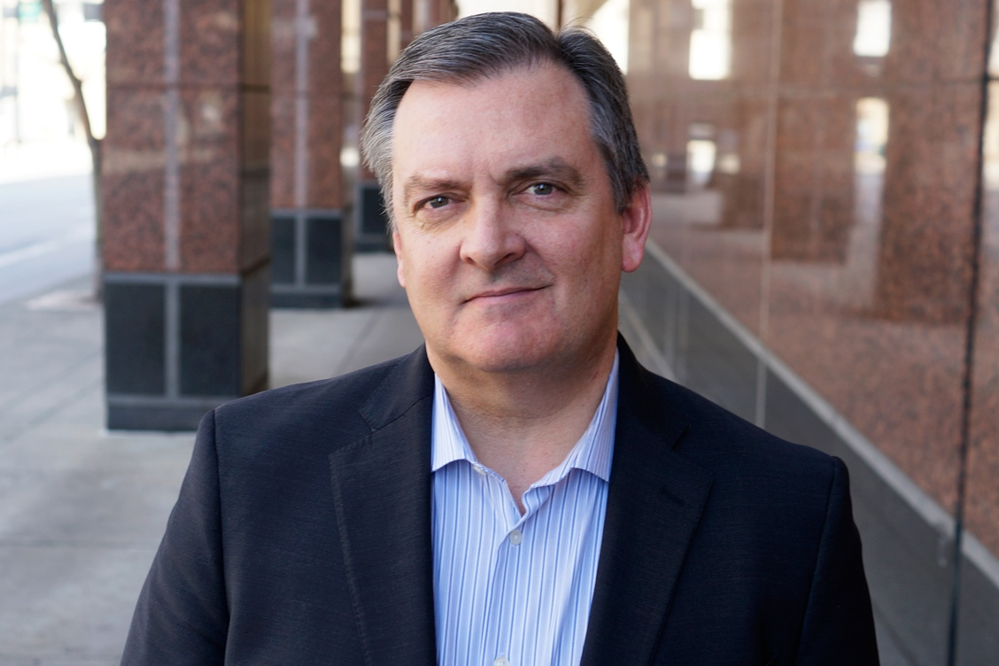

---

**Loan application.**

Before serving time for mortgage fraud, [Toby Groves](http://www.tobygroves.com/) seemed like the last person who would get into that kind of trouble. His older brother had been sentenced for the same crime twenty years earlier, and Toby had seen how it destroyed his family. He swore he’d never make a similar mistake.

Then in 2003, the company he’d founded ran into problems. Out of a sense of responsibility to his employees and their families, Toby took out a loan on his own house to make up the shortfall. He realized that he wouldn’t get the loan if he told the truth about his income on the loan application. So he boosted the number by a bit, thinking it was a short term fix. He thought, “If I just fudge the number a little, I’ll fix this big problem. I’ll save the company, save jobs.”

But it was not just a short term fix. He soon needed more money to save his business, so he fraudulently documented a loan for a made-up house and use those funds to pay off the first loan. He couldn’t do it by himself — he needed help from his staff and even other companies to pull it off. When he asked for their help, not one of them said “no”. They didn’t see it as a crime, but rather as helping a friend out of a tight spot.

No one ever stopped and said “I’m uncomfortable doing this”. The stakes grew ever higher until he realized he was in too deep. When the FBI showed up at his office in 2006, Toby quickly confessed, just glad that it was all finally over.

Toby Groves didn’t wake up one day and decide to pull off a $7 million mortgage fraud. He took the first step out of duty towards his employees, and each subsequent step between that moment and his final undoing felt like a natural progression. It was only when he looked back that he fully grasped what he had done.

---

**Ordinary citizens.**

American textbooks usually portray Nazis as psychopaths in uniform. But the reality was far more horrifying — ordinary German citizens carried out most of the tasks that made the Holocaust possible.

Historians [point out](http://www.nytimes.com/books/00/02/20/reviews/000220.20gewent.html?mcubz=1) that “the inefficient and overburdened Nazi regime depended on the support, indeed the active collaboration, of the citizenry for its survival”. They argue that it was more bottom-up than top-down, pointing to Hitler’s widespread popularity and to the depressingly few instances of overt resistance as evidence. This apparatus of terror centered on the Gestapo, “violence-prone true believers \[who\] had volunteered and enjoyed wielding power over others”, but it depended on the compliance of German citizens.

These “ordinary” individuals took part for reasons that were far more complex. Some wanted to gain social status, while others simply feared they would be shot if they did not comply. Still others welcomed the strong national bond with their ethnic group after decades of misery and global humiliation.

Others didn’t even fully realize what was happening until it was too late. In the beginning, many of the acts encouraged by the Gestapo seemed justified, or at least justifiable. They started by cracking down on political extremists. The focus on Socialists and Communists gave onlookers plausible deniability. These people posed a direct threat to the state, and some were violent, so few questioned the Gestapo’s right to use force to stop them.

The Gestapo then targeted Jehovah’s Witnesses, because they were unwilling to accept the authority of the military. This seemed like a natural extension of the earlier persecution of political extremists, so again the injustice was mostly overlooked. Sure, the Witnesses insisted that they were apolitical, but they refused to give the Nazi salute, to allow their children to join the Hitler Youth, or to be drafted, so they threatened the stability of the Reich.

Trade unionists were next. The labor movement exercised significant political power, representing a barrier to Nazi control over all areas of life. Again, the regime met little resistance from its citizenry. From there, the Gestapo continued to expand their reach. Over time, they rounded up groups for whom the argument that they might threaten the Reich was increasingly tenuous, but by then it was too late. The Nazis had consolidated their power.

By “methodically singling out particular groups of victims and going after them with every pretense of legality”, the Nazis’ incrementally increasing atrocities [boiled the frog](https://en.wikipedia.org/wiki/Boiling_frog#As_metaphor). The Gestapo began their repression by targeting those who were most widely considered criminals and trouble makers. It was hard to disagree with that. And even if you did disagree, it wasn’t exactly a popular cause to support them. By the time innocent women and children were being rounded up, the German populace was already in too deep. Not only had repression been normalized, but any who did recognize the horrific reality stood little chance of reversing the momentum working in favor of the regime.

After the war, Germans were humiliated by the atrocities of the Holocaust. Citizens [were appalled](http://rarehistoricalphotos.com/german-soldiers-forced-watch-footage-concentration-camps-1945/) when confronted with the harsh reality with which they had complied, and they responded with the idea that Germany above all has a mission to prevent anything similar happening ever again. Schools [spend a lot of time teaching about the Nazi era](http://www.slate.com/blogs/quora/2014/02/06/how_do_german_students_learn_about_the_holocaust.html), and [patriotism is taboo](http://www.spiegel.de/international/germany-s-patriotism-problem-just-don-t-fly-the-flag-a-411948.html). The [Memorial to the Murdered Jews of Europe](https://www.stiftung-denkmal.de/en/memorials/the-memorial-to-the-murdered-jews-of-europe.html#c694) is visible from the Reichstag parliament building in Berlin, intended as a reminder to the country’s leaders of its tragic past.

The Holocaust was antithetical to the values of most Germans. And yet somehow, it still happened.

---

**Framing.**

There is a lot of interesting research on how framing affects decision-making around ethical questions.

In [one study](http://www.jstor.org/stable/2667052?seq=1#page_scan_tab_contents) out of Cornell University, researchers found that framing can affect the type of decision a person perceives (s)he is making. This can cause people to overlook the ethical dimensions of their decision. Max Bazerman and Ann Tenbrunsel [describe](http://www.nytimes.com/2011/04/21/opinion/21bazerman.html?mcubz=1) the study:

> Participants were asked to play the role of a manufacturer in an industry known for emitting toxic gas. The participants were told that their industry was under pressure from environmentalists. The manufacturers had reached a voluntary but costly agreement to run equipment that would limit the toxic emissions. Some participants were told they would face modest financial sanctions if they broke the agreement; others were told they would face no sanctions if they did.

> An economic analysis would predict that the threat of sanctions would increase compliance with the agreement. Instead, participants who faced a potential fine cheated more, not less, than those who faced no sanctions. With no penalty, the situation was construed as an ethical dilemma; the penalty caused individuals to view the decision as a financial one.

In [another study](http://www.people.hbs.edu/mbazerman/Papers/Gino-Baz-06-007-Slippery%20Slopes.pdf), Harvard researchers found evidence that people are more likely to accept increasingly major infractions “as long as each violation is only incrementally more serious than the preceding one”. At the same time, people are more likely to recognize and stop unethical behavior of the same magnitude when the change is “abrupt”. A _Harvard Business Review_ article [described](https://hbr.org/2011/04/ethical-breakdowns):

> Bazerman and the Harvard Business School professor Francesca Gino explored this in an experiment in which the participants — “auditors” — were asked to decide whether to approve guesses provided by “estimators” of the amount of money in jars. The auditors could earn a percentage of a jar’s contents each time they approved an estimator’s guess — and thus had an incentive to approve high estimates — but if they were caught approving an exaggerated estimate, they’d be fined $5.

> Over the course of 16 rounds, the estimates rose to suspiciously high levels either incrementally or abruptly; all of them finished at the same high level. The researchers found that auditors were twice as likely to approve the high final estimates if they’d been arrived at through small incremental increases. The slippery-slope change blinded them to the estimators’ dishonesty.

And [another study](https://www.ncbi.nlm.nih.gov/pubmed/2266485) out of Case Western found that in interpersonal conflicts, the victim and perpetrator have different subjective interpretations. Charles Stangor [described](https://opentextbc.ca/socialpsychology/chapter/biases-in-attribution/) this study and the tendency for individuals to judge others more harshly and conclusively than themselves:

> The researchers analyzed the accounts people gave of an experience they identified where they angered someone else (i.e. when they were the perpetrator of a behavior leading to an unpleasant outcome) and another one where someone else angered them (i.e. they were the victim).

> The differences in attributions made in these two situations were considerable. When accounting for themselves as perpetrators, people tended to emphasize situational factors to describe their behavior as an isolated incident that was a meaningful, understandable response to the situation, and to assert that the action caused no lasting harm. When they were the victims, on the other hand, they explained the perpetrator’s behavior by focusing on the presumed character defects of the person and by describing the behavior as an arbitrary and senseless action, taking place in an ongoing context of abusive behavior that caused lasting harm to them as victims.

The differences in the framing in each of the examples above are ethically neutral\*. The effect on the environment of toxic gas remains the same, regardless of any fine imposed on the company or not; if anything, the monetary cost should weight the ethics on the side of the “correct” behavior, because of the leadership’s fiduciary duty to their shareholders. The dollar amount dishonestly acquired in the jar audit remains the same, regardless of the past guesses. And the same action that angered one person should have the same moral weight as the same action victimizing another. Yet the decision maker is more likely to accept or even perpetuate an unethical outcome under certain supposedly equivalent circumstances.

We’ve all seen this kind of inconsistent behavior. Just yesterday when I was biking down the street, a car nearly ran me over as it made a turn. I was pissed — what an idiot for not checking his blind spot! That’s one of the first things you learn about right hand turns! But if I think about it, I realize that I’ve made that exact mistake before while driving, resulting in a near-miss with a cyclist. I didn’t drive away thinking that I was an idiot driver. Rather, the thought was “Thank goodness that one-time mistake didn’t turn out badly… maybe I should get some coffee on my way to class, I guess I must be tired”.

These examples are [just](https://en.wikipedia.org/wiki/Illusory_truth_effect) [the](https://en.wikipedia.org/wiki/Bias_blind_spot) [tip](https://en.wikipedia.org/wiki/Choice-supportive_bias) [of](https://en.wikipedia.org/wiki/Confirmation_bias) [the](https://en.wikipedia.org/wiki/Contrast_effect) [iceberg](https://en.wikipedia.org/wiki/Dunning%E2%80%93Kruger_effect). There are so many ways we can trick ourselves into evaluating equivalent ethical decisions differently. Our evaluation can change depending on who is responsible, the context in which it happened, and what our reference points were. Of course these effects do not absolve the decision maker of his responsibility, but they are often disregarded when we judge history. These judgements then constrain the range of ethical actions of which we perceive ourselves to be capable, misleading ourselves into thinking we could never do terrible things.

---

Most suffering is not inflicted by an evil mastermind. When things go wrong, it’s usually because regular people take part. We underestimate how misguided intentions, counterproductive framing, and imperfect information can lead an ordinary person to do extraordinarily bad things.

History is messy, especially while it’s happening. If we simplify the story and write off those involved as lone villains, we risk making the same mistakes. When we view events as a simple morality play, we lose our ability to learn from the past.

We are all capable of behaving profoundly unethically, even when our intentions are good. It’s too easy to dismiss people who do bad things as corrupt or malicious. It’s important to remember that given the right set of circumstances, we too might make wrong choices.

History is too often reduced to stories of good versus evil. We get the impression that we are somehow different from the people who were bad, and we take for granted that we would never make similar choices. We should learn to empathize with those who make terrible choices — not to pardon their choices nor to deny ourselves the right to grieve, but to recognize when we might be heading down a similar path. If we see them as people and understand where they went wrong, we can avoid making the same mistakes.

---

_\* This is at least my view. You could of course give greater moral weight to your own personal sphere (i.e. you value utility for yourself, your family, and your friends more than for strangers), or you could believe something odd like the delta in behavior from some precedent is what’s morally relevant (“Well, he’s a little bit better than he used to be…”). But for the purpose of this essay, I’m going to consider the pairs of cases in the studies mentioned as ethically equivalent._

---

Thanks to Siyang Li and [John Backus](https://twitter.com/backus) for reading drafts of this essay. Special thanks to [Trevor Welch](https://twitter.com/trevorwelch), [Tim De Smedt](https://twitter.com/DeSmedtTim), [Tim Almond](https://twitter.com/DeSmedtTim), [Josh Thompson](https://twitter.com/josh_works), [Alex Harris](https://twitter.com/SideConstraints), and [Paul Crowley](https://twitter.com/ciphergoth) for doing the same and participating in [my writing feedback experiment](https://twitter.com/devonzuegel/status/917082102679486464). (And thanks to everyone else who offered!)