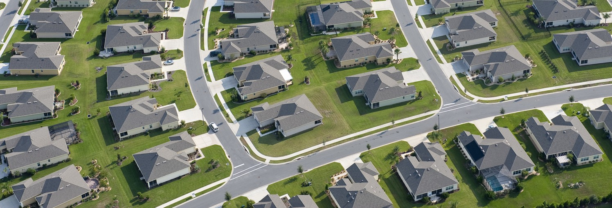
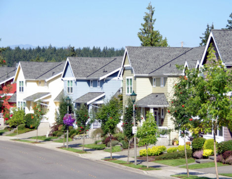
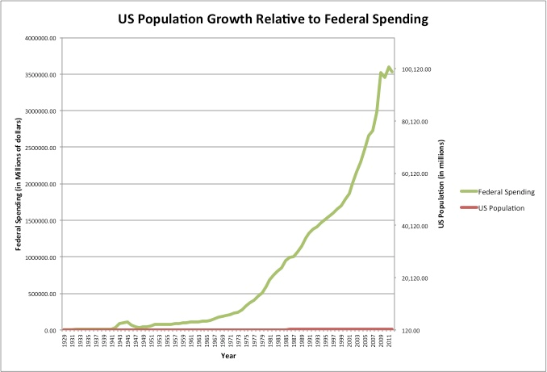
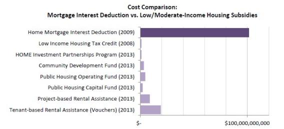
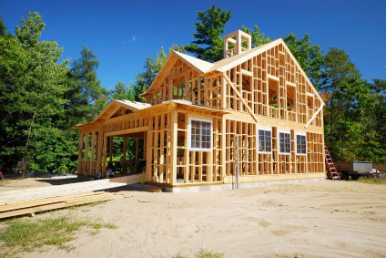
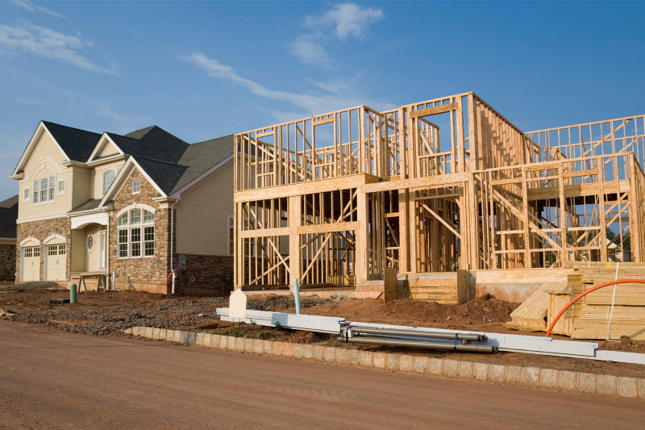
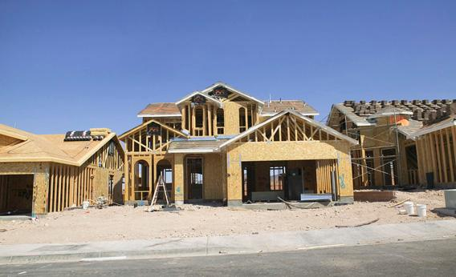

## _How suburban sprawl gets special treatment in our tax code_

_This is the third post in a series about government policies that encouraged suburban growth in the US. You can find the first part_ [_here_](https://medium.com/@devonmarisa/subsidizing-suburbia-2c3b66f88d4c) _and the second one_ [_here_](https://medium.com/@devonmarisa/financing-suburbia-6076dae990f8)_._

---

Suburban sprawl gets preferential tax treatment in the US. As a result, it is cheaper to spend a dollar on housing than on something else, so it encourages people to spend more money on housing. The tax code also favors new construction over renovation and [infill development](https://en.wikipedia.org/wiki/Infill).

These protections are pervasive throughout federal and state tax codes, but a few rules stand out:

1.  homeowners can deduct their property and mortgage interest,
2.  profits on home sales are not taxed,
3.  and new construction is a tax shelter

#### **1) Homeowners get major tax breaks**

Mortgage interest does not count as taxable income. In other words, homeowners can write off interest paid on their home loan in what is called the Mortgage Interest Deduction (MID). The MID was designed to encourage homeownership, but it benefits wealthy people who would have bought a home anyways the most. The MID encourages these people to spend more on their house, because the higher their tax bracket and the bigger their mortgage, the more they save.

The deduction is `(tax bracket) * (mortgage interest)`. So if you’re in the 25% tax bracket and you pay $5,000 per year in interest, you save $1,250 on your taxes. If you buy a bigger, more expensive house and pay $10,000 per year in interest, you save $2,500.

> Tax breaks incentivize homeowners to lobby for regulations that increase their property value, because they are not taxed on increases in that value.

Property taxes can also be deducted from a homeowner’s income. This has a similar effect as the MID, and it makes housing a much more attractive investment. It also encourages homeowners to lobby for regulations that increase their home’s value, because they are not taxed on increases in that value. This further tips the scales for people who own their home and against those who rent.

These lavish tax breaks push Americans towards the suburbs, because they encourage people to buy homes when they might otherwise rent. They also encourage people to buy larger homes than otherwise, because a dollar spent on a larger mortgage goes farther than that same dollar on any other purchase.

These rules were not intended to encourage the expansion of suburbia. When the income tax was first created in 1913, [only the wealthiest Americans paid income tax](http://www.pbs.org/newshour/rundown/the-income-tax-in-1913-a-way-to-soak-the-rich/) at all. The total amount of taxation was far lower at this time — the federal government itself was much smaller at the beginning of the 20th century — so its relative impact on the economy was small. But as the federal government expanded in the post-war period, tax revenues grew along with it, and so did their influence on the economy.

The MID and property tax deduction amount to some of the largest subsidies in the US. These two tax breaks cost $90 billion in 2015. For comparison, this is double the amount spent on public housing programs that year.

#### **2) Profits on home sales are not taxed**

The tax code provides huge incentive to purchase a home as an investment; it favors homeownership over investment alternatives by exempting home sales from capital gains tax. In other words, if your home value increases by the same amount as some other investment, the home investment has a greater net return, because the tax burden is zero. This encourages people to funnel capital from other forms of investment towards housing.

> The exemption pushes people to continue owning homes longer than they might otherwise, and it bolsters the market for ever-more-expensive dwellings.

Between 1951 and 1997, you could avoid taxes on home-sale profit if you used the money to buy another, more expensive house. This encouraged people to move into increasingly large homes over the course of their lifetime, even if they would have preferred to downsize as they got older. For instance, a retired widow with grown children might want to move out of her big suburban house and into a smaller apartment closer to downtown. But the tax code would have penalized that move by taxing the capital gains on her original more expensive house, giving her a reason to either stay in her home or purchase another one rather than renting. Researchers from Cleveland State University [found](http://onlinelibrary.wiley.com/doi/10.1111/j.1467-9906.1994.tb00322.x/abstract) that this deduction pushed people to continue owning homes longer than they might otherwise, and it bolstered the market for ever-more-expensive dwellings. In short, our tax code subsidized “upsizing” and uninterrupted homeownership.

In 1997, the Taxpayer Relief Act (TRA) expanded this deduction. Now, homes are exempt from capital gains in most cases, making homeownership even more attractive. By eliminating the tax burden for most home sales, the law made homes a better investment than alternatives with the same “upside” and risk profile.

Some economists [point](https://taxfoundation.org/did-1997-capital-gains-tax-exclusion-housing-contribute-economic-crisis/) to this tax change as a key cause of the housing bubble and subsequent crash in 2007. Economist Russ Roberts [credits](http://cafehayek.com/2008/09/some-bubble.html) it for the run-up in prices in the early 2000s, and Nobel Prize winner Vernon Smith [argued](http://online.wsj.com/article/SB119794091743935595.html) that “the end of the capital-gains rainbow … fueled the mother of all housing bubbles”. Even before the crisis, it was clear that the TRA had dramatically increased the subsidy to homeownership. In 2005, Chris Farrell [attributed](http://www.businessweek.com/bwdaily/dnflash/jul2005/nf20050726_4208_db013.htm) “the powerful lure of tax-free profit \[as\] one reason that home prices \[had\] risen at a nearly 7% annual rate, vs about 4% for the stock market since 1997”. The value of selling a home went up, so homeownership became more attractive relative to alternatives.

#### **3) New construction is a tax shelter**

“There’s probably no special interest that’s more favored by the existing tax code than real estate,” said tax lawyer and Brookings fellow Steven M. Rosenthal in [a _New York Times_ interview](https://www.nytimes.com/2017/04/22/business/trump-tax-real-estate.html?mcubz=1). Countless tax breaks favor the new construction, and these in turn subsidize sprawl on the fringes of existing communities.

> “There’s probably no special interest that’s more favored by the existing tax code than real estate.”

For example, builders can deduct the depreciation of new commercial buildings. A 1954 law permitted “accelerated depreciation”, which allows businesses to take most of the deduction in the first years of the structure’s life. It was intended to spur businesses to update factories, but its greater effect was to make construction a lucrative tax shelter. Thomas Hanchett noted in [_From Tenements to the Taylor Homes_](https://www.amazon.com/gp/product/027102013X/ref=as_li_tl?ie=UTF8&camp=1789&creative=9325&creativeASIN=027102013X&linkCode=as2&tag=devon04-20&linkId=6400319156fd280a7d479fc09fc414b5):

> As investors discovered the twist, money began pouring into real estate development. Though intended to spur factory modernization, the law’s language referred simply to “income-producing” buildings, which included stores, offices, and rental housing, as well as industrial structures. “Profits in Losses: Real Estate Investors Turn Depreciation Tax Write-Offs into Gains” headlined an enthusiastic 1961 front-page story in The Wall Street Journal. By the mid-1960s, the tax break was costing the U.S. Treasury more than $700 million per year. By comparison, Washington had spent virtually that same amount over ten years of the Urban Renewal Program aimed at revitalizing America’s central cities.

Hanchett continues, explaining how these depreciation rules inadvertently favored suburbia:

> Accelerated depreciation rules inadvertently favored suburbia. The write-off was greater for new construction than for renovation, and new construction was usually easiest on the open lands of the urban periphery. Also, the law forbade write-offs for depreciation of land, so that developers often shied away from urban projects with high land costs.

This is one of many tax breaks that benefit new construction. These policies, combined with the tax breaks directed at individual home owners, promote new dispersed development and redirect investment away from urban areas. Though its rules were shaped with different goals in mind, this feature of the US tax code is a massive subsidy to suburban development.

---

Our tax code favors suburbia. Homeownership, greenfield development, and sprawl receive preferential tax treatment, and the market responds to incentives built into the code. As a result, a disproportionate amount of capital flows to those investments. In many cases, it has been an unintentional side effect of pursuing other goals. The combined effect is that our tax system plays a huge role in shaping our communities. Its influence is an important factor to understanding how residential design in the US became what it is today.

