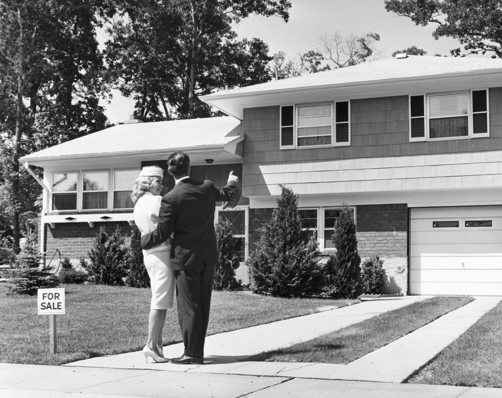
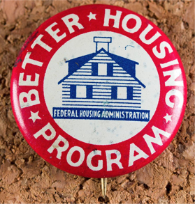
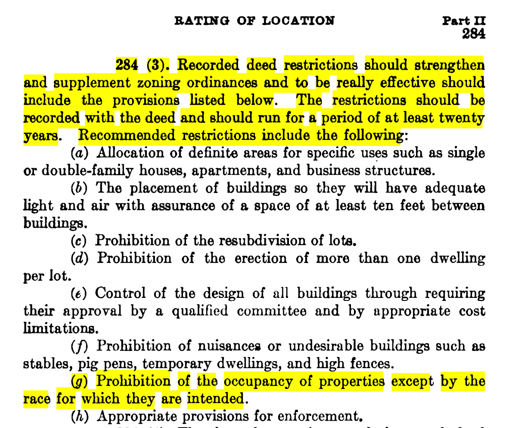
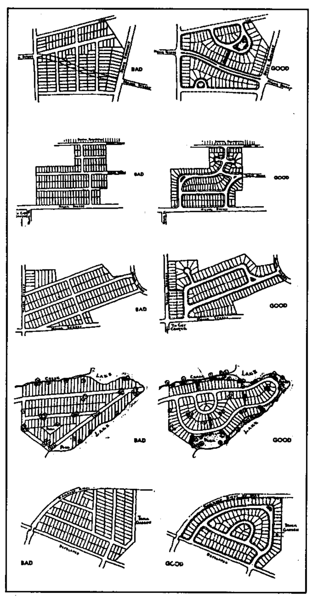
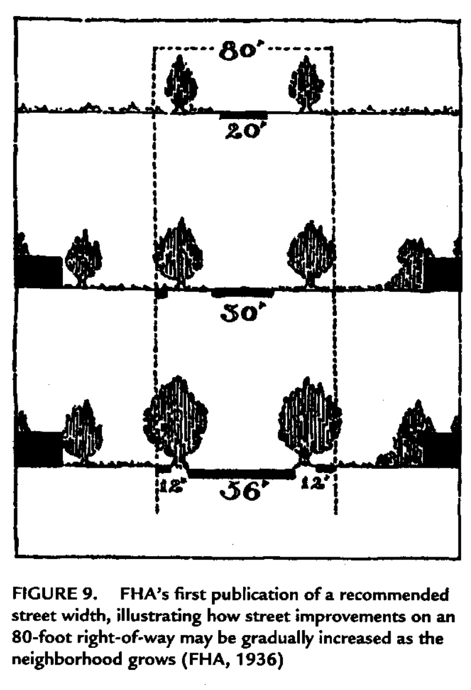
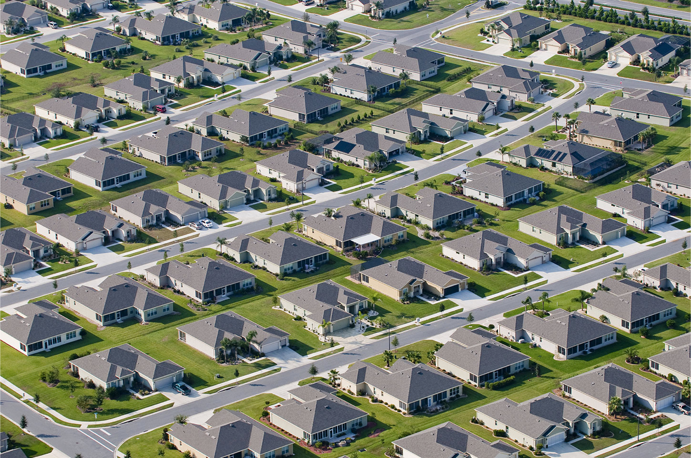

## How government mortgage policy determined where you live

_The government exercises tremendous power over residential design in the US. Its influence is nearly invisible, because it works through complex financing programs, insurance incentives, and secondary markets. These mechanisms go unnoticed, but their effect is hard to miss — they remade the United States into a nation of sprawling suburbs._

_This is the second post in a series about government policies that encouraged suburban growth in the US. You can find the first post_ [_here_](https://medium.com/@devonmarisa/subsidizing-suburbia-2c3b66f88d4c)_._

---

What image springs to mind when you picture “federally subsidized housing”? Most people imagine a low-income public housing tower, a homeless shelter, or a shoddy apartment building.

Nope — _suburban homeowners_ are the single biggest recipient of housing subsidies. As a result, suburbs [dominate](https://www.planetizen.com/node/77216) housing in the United States. For decades, federal finance regulations incentivized single-family homes through three key mechanisms:

1.  Insurance,
2.  National mortgage markets, and
3.  New standards for debt structuring

The housing market hides these details from the typical home buyer. As a result, most people are unaware of these subsidies. But their effects are striking — they determined the location and shape of development across America for generations.

### A New Deal to restore the housing industry

Debt has a negative connotation these days. Credit cards, student loans, and auto loans are the anchors that keep many Americans in debt for most of their life. Meanwhile, we view mortgages very differently — they are seen as an investment, a symbol of adulthood, and a sign of financial stability.

This was not always the case. In the early 1900s, mortgages were just like any other kind of debt. Nowadays payments are [spread out](https://en.wikipedia.org/wiki/Amortization_schedule) over decades, but back then they [came due all at once after a few years](https://en.wikipedia.org/wiki/Balloon_payment_mortgage). Most people didn’t have enough cash at the end of the term. It was standard to pay back some and negotiate a new loan for whatever they still owed.

This worked fine while the economy was booming, but investors refused to renew the loans after the 1929 stock market crash. Homeowners missed payments, and [foreclosure rates doubled](https://files.stlouisfed.org/files/htdocs/publications/review/08/05/Wheelock.pdf#page=7). The housing industry collapsed, taking the economy down with it.

New Deal policymakers realized that restoring the economy depended on restoring the housing sector. In 1934, they created the Federal Housing Administration (FHA) with two key mandates:

1.  Revive the housing market, and
2.  Make homeownership attainable for more Americans

In pursuing these goals, the FHA determined the design, structure, and location of new private development. In turn, it made suburbia the dominant form of housing in the United States.

The FHA seems dry and technical, but its implications are immense. It provides insurance on mortgages that meet certain criteria, repaying the principal to lenders if borrowers default. We take the program for granted now, but in 1934 it was radical. While most Depression-era initiatives infused the economy with money, the FHA was unique in that it did not spend a dime to stimulate the housing market. Rather, it boosted the lenders’ confidence in the stability in the market.

It mandated low interest rates, so investors’ returns weren’t as high as they had been, but risks were nonexistent. Lenders had been spooked by the crash, but they came rushing back with the promise of guaranteed profits. The FHA created a space for the private market to act, and in doing so it unleashed vast amounts of private capital. Government programs like the [PWA](https://en.wikipedia.org/wiki/Public_Works_Administration) or [HOLC](https://en.wikipedia.org/wiki/Home_Owners%27_Loan_Corporation) were tiny in comparison.

### “The most ambitious suburbanization plan in US history”

By making an offer lenders couldn’t refuse, the FHA exercised tremendous power over residential design.  Mortgages had to meet an opinionated set of criteria to qualify for the federal insurance. Lenders could invest in mortgages not covered by the program, but they had a strong preference for homes that conformed to the guidelines. Compliance was mandatory for the insurance, so they pressured developers to follow the rules. By 1959, 25 years after it was formed, the FHA had helped three out of every five American families purchase a home.

> By making an offer lenders couldn’t refuse, the FHA exercised tremendous power over residential design.

FHA rules had implicit and explicit hierarchies of what homeowners ought to want. They had two key purposes: to stimulate the economy, and to constrain the market to only good investments. These goals — plus social assumptions of the time — were reflected in the FHA’s evaluation of a mortgage. The standards included:

-   Large, new homes were given a higher score, because they increased demand for labor and materials. Older homes with small spaces didn’t create demand for new furniture. Features like long hallways and steep staircases lowered the rating, because they prevented easy moving of furniture.
-   Homogeneity of neighboring housing stock was believed to indicate stable housing prices. To get the max score on the FHA evaluation, the manual preferred that a house be a part of “a sparsely developed new neighborhood … completed over the span of very few years.”

-   The ideal house had “sunshine, ventilation, scenic outlook, privacy, and safety”, and “effective landscaping and gardening” added to its worth. The guide recommended that houses should be set back at least 15 feet from the road, and well-tended lawns that matched the neighbors’ yards helped the rating.
-   The manual had strict definitions for how streets should be built.
-   It prescribed minimum street widths and other specific measurements.
-   It recommended a hierarchical network, with a major arterial roads interlaced with smaller streets. The idea was to separate through traffic and enable efficient circulation.
-   It saw cul-de-sacs as the most desirable home locations, because they were most isolated from foot and auto traffic coming from outside of the neighborhood.

-   The guidelines favored auto- rather than transit-oriented development. The idea was that this would increase demand for cars, which were a growing part of American manufacturing.

-   The manual emphasized that suburbs must be arranged to promote strict separation of land uses
-   Multi-use districts with “commercial, industrial, or manufacturing enterprise” were seen to threaten residential value. So, the FHA simply did not provide insurance for units where the first floor was a shop with residences above for most of the agency’s lifetime.
-   Development like what you see in Greenwich Village and other traditional neighborhoods in east coast cities could not get an FHA loan. ([These rules only changed in 2015.](http://blogics.loanlogics.com/financing-a-mixed-use-property-is-now-easier-is-that-a-good-thing/))
-   “There would be no corner groceries; if there were any stores at all, they would be grouped into a single shopping center,” wrote Tom Hanchett in [_The Other “Subsidized Housing”_](https://www.historysouth.org/wp-content/uploads/2015/12/The-Other-22Subsidized-Housing22-Federal-Aid-To-Suburbanization-.pdf).

The combined effect of these standards was [the most ambitious suburbanization plan in United States history](http://web.mit.edu/ebj/www/doc/JAPAv61n1.pdf). The FHA favored suburbia, so subdivisions became one of the most common neighborhood types within a few decades.

### New frontiers for suburbia

New Deal programs enabled the expansion of suburbia into new regions, too. Prior to the Depression, mortgages were extremely local. Investors could not lend money from a distance, so capital accumulated in slow-growth areas and was scarce in fast-growing ones.

In commoditizing mortgages, New Deal programs made possible a national mortgage market for the first time. FHA guidelines standardized home loans, which allowed lenders across the country to treat loans of the same rating as [fungible](https://en.wikipedia.org/wiki/Fungibility). Since the quality of these homes was assured by FHA inspectors, [“investors from all over the country would know exactly what a particular mortgage was worth”](https://books.google.com/books?id=M5xk1rKh8ncC&pg=PA54&lpg=PA54&dq=%E2%80%9Cinvestors+from+all+over+the+country+would+know+exactly+what+a+particular+mortgage+was+worth%E2%80%9D&source=bl&ots=AlImnPpA7X&sig=a45V60mATvz6vobABzsep9eSzs8&hl=en&sa=X&ved=0ahUKEwij2oz52PHUAhVExlQKHd7nChgQ6AEIJjAA#v=onepage&q=%E2%80%9Cinvestors%20from%20all%20over%20the%20country%20would%20know%20exactly%20what%20a%20particular%20mortgage%20was%20worth%E2%80%9D&f=false). For the first time, capital-rich investors could lend money to developers expanding into the south and west.

The creation of the [Federal National Mortgage Association](http://www.investopedia.com/articles/investing/091814/fannie-mae-what-it-does-and-how-it-operates.asp) (FNMA, better known as Fannie Mae) in 1938 took this a step further. Fannie Mae creates a secondary market by purchasing mortgages from lenders. It creates liquidity for these originators, which in turn allows them to underwrite more mortgages. The federal government created [Freddie Mac (FHLMC)](https://en.wikipedia.org/wiki/Freddie_Mac) in 1970 to serve a similar purpose. The combination of these secondary markets and the FHA guidelines was in effect a massive financing of suburban sprawl, all facilitated by the federal government.

> This subsidized sparsely populated parts of the country, while disadvantaging older metropolitan areas.

The government also set a national limit on interest rates for mortgages. It created a standard rate for the country as a whole, where before there had been immense variation. Mortgages had been far more expensive in the west and south than in the capital-rich northeast. The new standard rates made it artificially cheap to finance new development in the southwest. This subsidized sparsely populated parts of the country, while disadvantaging older metropolitan areas. It also coincided with the creation of the interstate highway system, on which we’ll go into more detail in an upcoming post.

### New markets for suburbia

While federal programs increased the geographic size of the market, they also increased the number of people who could afford a down payment. They did this by tweaking the structure of mortgage debt in two ways:

(1) They decreased the size of monthly payments by spreading them over a longer period of time.

-   Federally-backed loans required terms of at least 10 years, replacing the balloon mortgages of the 1920s. This paved the way for the standard 30-year mortgage that we have today.
-   Borrowers [focus on the size of these monthly payments](https://www.nytimes.com/2015/01/09/business/auto-leasing-gains-popularity-among-american-consumers.html) rather than the total, so this made mortgages more affordable without actually decreasing their cost.

(2) Federal programs slashed what was an acceptable downpayment.

-   Before, the buyer had to pay upwards of 50% of the purchase price in cash, but with the FHA guarantees, banks were willing to accept down payments of just 10%.
-   To reward G.I.s returning from WWII, the Veterans Administration (VA) offered mortgage aid as well. The VA insurance program was even more generous than the FHA, so by midcentury banks offered as low as 0% down to newly returned veterans. These set the standard for conventional mortgages within a few years.

Harvard economist Edward Glaeser [described](https://www.evernote.com/shard/s214/sh/356f3b01-c177-4c47-aaa2-df17007c472d/2cf0fbf8d6d5e05f) the impact of “the mortgage subsidies that were explicit in the tax code and implicit in Freddie Mac and Fannie Mae” in a _Boston_ op-ed:

> These home-borrowing subsidies … pull people out of America’s urban centers. More than 85 percent of people in detached homes are owner-occupiers, in part because renting leads to home depreciation. More than 85 percent of people in larger buildings rent. Since ownership and structure type are closely connected, subsidizing homeownership encourages people to leave urban high-rises and move into suburban homes.

By making long-term, amortized loans with low down payments the norm, federal policies made it possible for millions of people to buy single-family homes. These homeowners enthusiastically moved into the new mass-produced subdivisions to the west.

### Invisible subsidies

On the surface, mortgages appear to be a mostly free market enterprise. Buyers take out financing through a private broker; they find a home through a private real estate agent; and they purchase their home from a private developer. Some people take out FHA loans, and everyone has to deal with the pesky permitting process, but for the most part homeowners transact with private parties.

The system masks a huge amount of government intervention. It isn’t evident to the average person, because it works through obscure mechanisms like insurance and financing terms. These don’t look like conventional cash subsidies, but they distort incentives, supply, and demand in the same way. Though these mechanisms go mostly unnoticed, they have transformed residential finance in America.

The US is [the most suburban country in the world](http://www.newgeography.com/content/005495-suburban-nations-canada-australia-and-united-states). Most assume this is the organic result of individual preferences, because there’s little visibility into the ways that policy has shaped incentives. The reality is that government intervention played a huge role. Because these subsidies are complex and technical, it’s easy to forget their long history, but if we want to begin to understand the current state of the housing market, we have to first understand how we got here.

---

_Thanks to John Backus, Siyang Li, Chris Barber, Leopold Wambersie de Brower, Omar Rizwan, Tiffany Jung, Aurélien Chouard, Rahul Gupta, Barak Gila, Marcel Horstmann, and John Luttig for reading this over._ ❤

---

#### **Notes, resources, and further reading**

I cannot in good conscience discuss the history of home finance in the US without mentioning redlining. This was the practice of denying loans to residents of certain areas due to the racial makeup of those communities. The FHA and VA pioneered this racist practice, and they set the standard for private mortgage providers as well. It was a defining feature of the US housing market for generations, and until recently it was ignored in nearly every major high school history textbook. Other people have given this issue far better treatment than I ever will, so I’ll point you to those, but I wanted to at least mention it so you can learn more about it:

-   [The Racist Housing Policy That Made Your Neighborhood](https://www.theatlantic.com/business/archive/2014/05/the-racist-housing-policy-that-made-your-neighborhood/371439/) from _The Atlantic_
-   [1934–1968: FHA Mortgage Insurance Requirements Utilize Redlining](http://www.bostonfairhousing.org/timeline/1934-1968-FHA-Redlining.html) from Boston Fair Housing

Louis Hyman’s book [_Debtor Nation: The History of America in Red Ink_](https://smile.amazon.com/gp/product/0691156166/ref=as_li_qf_sp_asin_il_tl?ie=UTF8&tag=devon04-20&camp=1789&creative=9325&linkCode=as2&creativeASIN=0691156166&linkId=f94b9af721a92ab07297f8ef0f6b61ea&sa-no-redirect=1)  was instrumental in writing this post. I originally picked it up as a history of credit in the US, but it went way beyond that. The chapter about home finance opened my eyes to the the government-created incentives that shape cities. It is what led me to learn more about the impact of policy on residential development and rethink deep-set assumptions about why our country looks the way it does.

I nearly stopped writing this when halfway through I discovered Thomas Hanchett’s paper [_The Other “Subsidized Housing”: Federal Aid to Suburbanization, 1940s-1960s_](https://www.evernote.com/shard/s214/sh/5c5325d4-99d9-4b57-9ecf-48fb8c44f859/3fb9ac5c1711caa8). It hit every major point I intended to articulate, and it introduced other ways that the government has shaped our communities that I’d never heard about. I decided to continue, because my purpose — to communicate these complex policies to people who aren’t finance policy nerds — was different from his, and new information has surfaced since it was published in 2000, but it’s a great resource to dive into more details that didn’t fit in this essay.

There’s so much more interesting stuff to dive into about the structure, incentives, and outcomes of the FHA. I didn’t go into them here, but I encourage you to read more about it! It’s incredible how much they’ve shaped the US housing market, even today. You can find a full PDF of the 1936 FHA _Underwriting Manual_ [here](http://epress.trincoll.edu/ontheline2015/wp-content/uploads/sites/16/2015/03/1936FHA-Underwriting.pdf)_._

To learn more about the **mortgage interest deduction**:

-   [The Accidental Deduction: A History and Critique of the Tax Subsidy for Mortgage Interest](https://papers.ssrn.com/sol3/papers.cfm?abstract_id=1498784) from _Law & Contempary Problems, Vol. 73_
-   [Who Benefits from the Home Mortgage Interest Deduction?](https://taxfoundation.org/who-benefits-home-mortgage-interest-deduction) from Tax Foundation
-   [Ways forward to more equitable land use law](http://cityobservatory.org/ways-forward-to-more-equitable-land-use-law/) from _City Observatory_
-   [The mortgage interest deduction: Its geographic distribution and policy implications](https://www.evernote.com/l/ANado9WeE8RDEqldUVknUAB60RHy4c0cMHo) from _Journalist’s Resource_
-   [How the mortgage interest deduction hurts our cities](https://www.evernote.com/l/ANbsJmm_f7FCmajp5RzS8BAFIl68S-gVdV4) from _MinnPost_

To learn more about **depreciation**:

-   [Real Estate Depreciation and Tax Sheltering](http://www.finweb.com/taxes/real-estate-depreciation-and-tax-sheltering.html#axzz4nashxMWY) from Financial Web

To learn more about the **capital gains exclusion**:

-   [5 Things You Should Know About Capital Gains Tax](https://turbotax.intuit.com/tax-tools/tax-tips/Investments-and-Taxes/5-Things-You-Should-Know-About-Capital-Gains-Tax/INF26154.html) from Turbotax
-   [Homeowners get a big tax break when they sell: A capital gains tax exclusion](http://www.bankrate.com/finance/taxes/capital-gains-and-your-home-sale-1.aspx) from Bankrate
-   [More support for a real estate capital gains tax](http://cityobservatory.org/more-support-real-estate-cap-gains-tax/) from City Observatory

Further reading:

-   [Street Network Types and Road Safety](https://www.evernote.com/l/ANa6lW3ECeZJpb_OczEQnRf3VgsIvON3zMY) from University of Connecticut
-   [Trump’s Industry, Real Estate, Poses Hurdle to Tax Overhaul](https://www.nytimes.com/2017/04/22/business/trump-tax-real-estate.html) from _The New York Times_
-   [Starving the cities to feed the suburbs](https://www.evernote.com/l/ANaIswfZfxpPeJjbH4NTnWE_e-GdJNyhsb8) from _Grist_