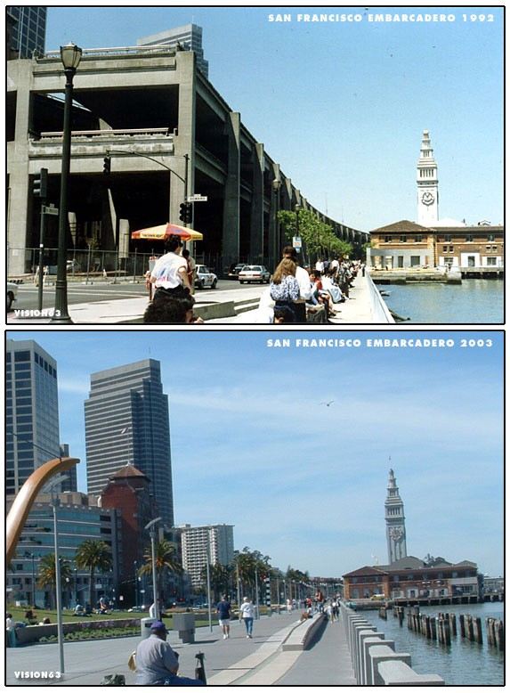
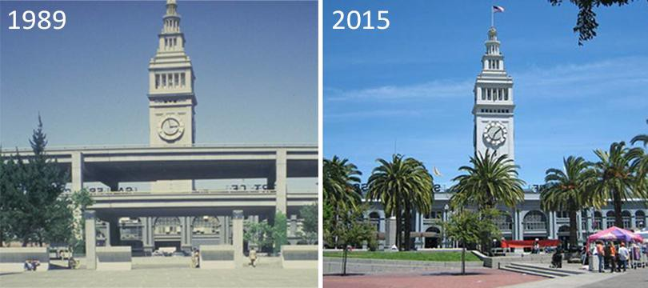
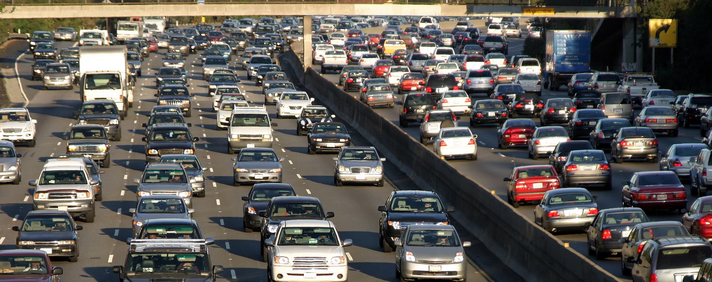
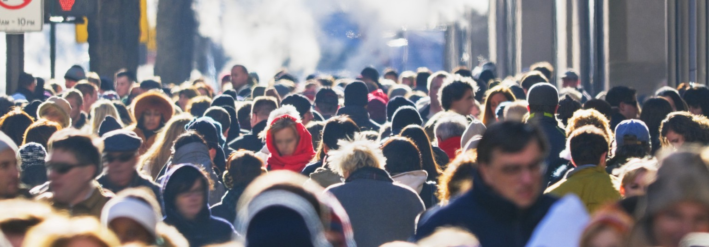
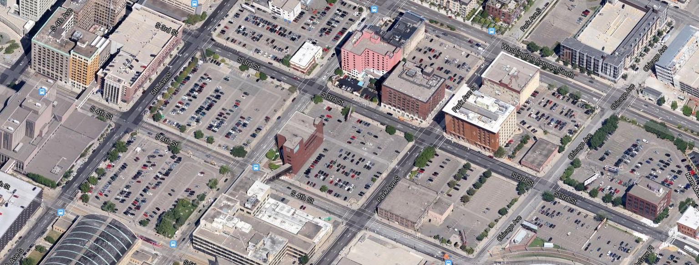
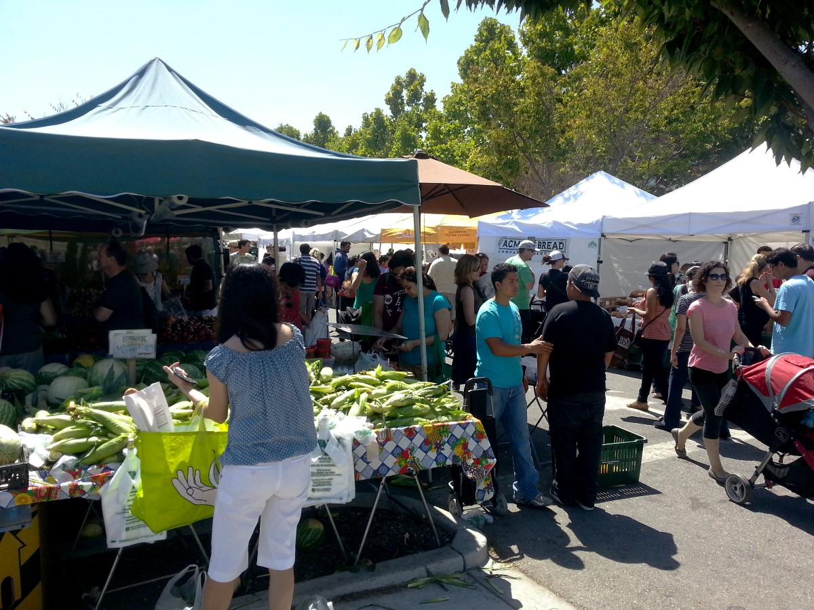
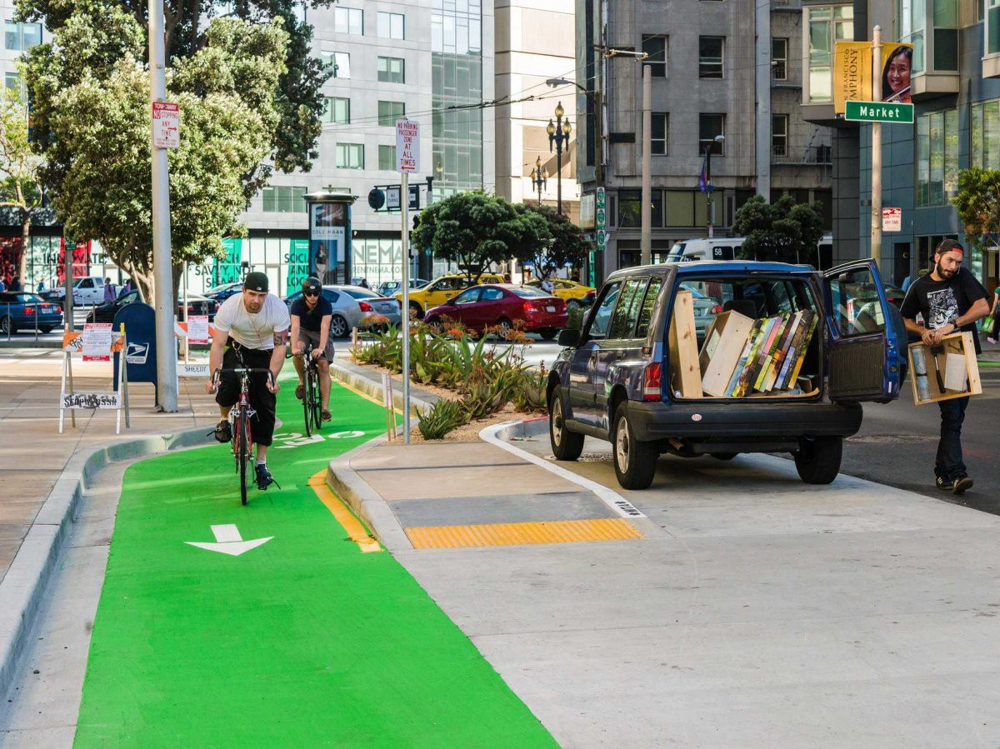

_The way we live is shaped by our infrastructure — the public spaces, building codes, and utilities that serve a city or region. It can act as the foundation for thriving communities, but it can also establish unhealthy patterns when designed poorly._

For decades, San Francisco’s waterfront was dominated by the massive Embarcadero Freeway. The Ferry Building was hidden in the shadow of a grungy overpass, and the double decker highway blocked residents’ access to the bay all along the eastern edge of the peninsula. One local writer [said](https://books.google.com/books?id=-ywDBAAAQBAJ&lpg=PA144&ots=uB1n9Xv9K3&dq=William%20Thompson%20%20%22shunted%20pedestrians%20through%20a%20dark%2C%20sooty%20gauntlet%20between%20downtown%20and%20the%20San%20Francisco%20Bay%22&pg=PA145#v=onepage&q=William%20Thompson%20%20%22shunted%20pedestrians%20through%20a%20dark,%20sooty%20gauntlet%20between%20downtown%20and%20the%20San%20Francisco%20Bay%22&f=false) the freeway “shunted pedestrians through a dark, sooty gauntlet between downtown and the San Francisco Bay”.  
   
 Then, in 2002, the freeway was replaced with a palm-lined boulevard and a streetcar line down the middle. The Embarcadero was transformed from a fading industrial zone into a center of tourism and leisure. San Francisco’s stunning waterfront became a destination rather than just a place to pass through.  
   
The turning point for the Embarcadero was the 1989 Loma Prieta earthquake that destroyed the freeway. Demolition proposals had always been shot down due to fears that it would create unbearable traffic. The quake forced San Franciscans to live without the freeway, and they quickly discovered that the feared congestion never happened. Instead, the neighborhood saw a massive economic boost, and the new boulevard is one of the best parts of the city. By damaging the highway beyond repair, the quake was able to do what political pressure couldn’t.

Unfortunately, America’s inherited infrastructure is more like the old Embarcadero Highway than the boulevard that replaced it. Urban planners spent the 20th century building cities for cars, not people, and alternatives to driving have been systemically undervalued. This legacy has resulted in substandard health outcomes, missed economic opportunities, and a shortage of affordable housing.

We can’t wait around for another earthquake to reverse generations of bad policy. Luckily, it doesn’t require a natural disaster to begin reshaping our infrastructure. Small changes can have an outsized impact in expanding alternatives for how people move around. Rebuilding our infrastructure to enable walking, cycling, and mass transit would bring health and economic benefits that far outweigh its price tag.

### Our infrastructure is making us sick

The American health care crisis is at its heart an urban design crisis. To get a sense for the toll our car-centric infrastructure has taken on our physical and mental well-being:

-   [Car fatalities](https://en.wikipedia.org/wiki/List_of_motor_vehicle_deaths_in_U.S._by_year) have killed far more Americans than [all of our wars combined](http://www.pbs.org/newshour/updates/many-americans-died-u-s-wars/).
-   Commuting by car [ranks as people’s least favorite regular activity](http://www.huffingtonpost.com/kirsten-dirksen/happiness-research-ranks-_b_829591.html).
-   A 23 minute driving commute has the [same effect on happiness as a 19% reduction in income](https://books.google.com/books?id=VEUlBQAAQBAJ&pg=PT68&lpg=PT68&dq=driving+commute+has+the+same+effect+on+happiness+as+a+reduction+in+incomes&source=bl&ots=chNIIe4YMU&sig=5qd8i1ztJrki9WcrOIl2Wj9UfTc&hl=en&sa=X&ved=0ahUKEwiW1YekgLjOAhUH42MKHTb6AnAQ6AEIJDAB#v=onepage&q=driving%20commute%20has%20the%20same%20effect%20on%20happiness%20as%20a%20reduction%20in%20incomes&f=false).
-   For every extra 5 minutes Atlanta residents drive each day, they are [3% more likely](http://www.ncbi.nlm.nih.gov/pmc/articles/PMC1247496/) to be obese.

“Doctors focus on remote disease risks, but what really kills us is our built environment,” [explained](http://www.metropolismag.com/October-2006/Our-Ailing-Communities/) Dr. Richard Jackson, a physician who served for 9 years as the CDC’s Director for Environmental Health. People who walk, bike, or take some form of mass transit to work [weigh less](http://www.reuters.com/article/us-commute-weight-study-idUSKBN0GJ29V20140819), [live longer](http://www.apta.com/mediacenter/pressreleases/2010/Pages/100811_Public%20Health%20Benefits.aspx), and [have lower divorce rates](http://www.inc.com/jeff-haden/why-a-long-commute-could-ruin-your-marriage.html) than commuters who drive. They also have [lower rates of depression](https://www.psychologytoday.com/blog/urban-survival/201501/commuting-the-stress-doesnt-pay), [more free time](http://www.dailymail.co.uk/news/article-2557564/Its-official-Commuting-work-makes-miserable-spending-half-hour-bus-worst-way-travel.html), and a [more robust social life](http://www.newyorker.com/reporting/2007/04/16/070416fa_fact_paumgarten).

Despite its costs, driving remains the most common mode of travel in the US, at around [85 percent of commuting trips](https://www.census.gov/hhes/commuting/files/2014/acs-32.pdf). [One out of six workers](https://books.google.com/books?id=0726UXcSEEsC&pg=PA46&lpg=PA46&dq=Roughly+one+out+of+every+six+American+workers+commutes+more+than+forty-five+minutes,+each+way&source=bl&ots=6GkbbrpgZ9&sig=lT2Vy_433DG8K7i7OHlBrnO5aKc&hl=en&sa=X&ved=0ahUKEwiLvu-Rg7jOAhUH8mMKHcgEBdsQ6AEIHjAA#v=onepage&q=Roughly%20one%20out%20of%20every%20six%20American%20workers%20commutes%20more%20than%20forty-five%20minutes,%20each%20way&f=false) commutes more than 45 minutes each way, and private vehicles account for [60% of trips a mile or shorter](http://bikeleague.org/content/national-household-travel-survey-short-trips-analysis). But it’s not drivers’ fault; rather, our infrastructure encourages — and in many cases forces — us to depend on cars. Our communities are built at the scale of highways rather than humans. Expressways slice through neighborhoods, and widened streets prioritize the flow of cars over making it worth traveling to their destinations. In the 1950s and 60s, [large scale demolitions](http://urbanomnibus.net/2015/06/the-scythe-of-progress-must-move-northward-urban-renewal-on-the-upper-west-side/) were commonplace in order to make way for fast moving motorized traffic, and communities from [New York](http://untappedcities.com/2013/12/18/5-things-in-nyc-we-can-blame-on-robert-moses/) to [Los Angeles](http://www.slate.com/blogs/the_vault/2014/07/25/transit_history_in_los_angeles_a_1906_map_of_the_city_s_streetcar_system.html) have never fully recovered.

People choose to drive despite its costs because they lack reasonable alternatives. Unfortunately, this isn’t an accident of history. Our transportation system has been overly focused on automobile traffic flow as its metric of success. This single-minded focus has come at the cost of infrastructure that supports alternative ways to travel. Traffic flow should instead be one goal out of many. Communities would be far healthier if our infrastructure actively encouraged walking, cycling, and other forms of transportation rather than subsidizing driving and ignoring alternatives.

### Walkability has major economic benefits

It makes financial sense for cities to invest in walkability. There is a [scarcity of walkable neighborhoods](http://jpe.sagepub.com/content/24/3/317.abstract) in the US housing market, and this unmet demand is reflected in the prices people are willing to pay for housing in those cities that embrace a pedestrian-friendly model. Cities that remove barriers to pedestrian-centric development have an economic edge on those that do not.

Having a critical mass of pedestrians signals that a neighborhood is safe and interesting, which in turn draws more people into that area. This creates a positive feedback loop — with people and opportunities nearby, it becomes increasingly attractive for businesses and residents to move in. Walkability [correlates](https://www.redfin.com/blog/2009/08/new-study-shows-one-point-of-walk-score-worth-up-to-3000.html) with property values so closely that it has become standard practice in real estate to advertise a home’s “walk score”, because a high grade earns a premium. [Websites like Zillow and Apartments.com](https://www.walkscore.com/professional/case-studies.php) offer calculations for commute length and walkability to everyday destinations like grocery stores, and it is common for real estate agents to advertise the walk score as a major selling point.

The Embarcadero in San Francisco is a perfect illustration of how transitioning away from car-centric infrastructure can revitalize a neighborhood. When the highway was removed in 2002, [the area experienced a massive economic boost](https://reclaimingoldwestbroad.files.wordpress.com/2014/04/chapter-9-appendix-1-related-articles-and-case-studies.pdf). Within four years, housing in the area increased by 51% and jobs increased by 23%, and by freeing up land for development, the highway removal has also increased the city’s tax base.  
   
Portland offers another helpful model. In contrast to most American cities, Portland has invested in multiple modes of transportation for decades. As a result, its residents drive 20% less than other major metropolitan areas, and the city has experienced economic benefits beyond just a rise in property values. “Portlanders save a bundle on cars and gas, \[so\] residents have more money to spend on other things they value, which in turn stimulates the local economy,” said economist Joe Cortright in [_Portland’s Green Dividend_](http://blog.oregonlive.com/commuting/2009/09/pdxgreendividend.pdf). Less driving leads to greater savings, and those savings flow to the local economy rather than distant oil producers.

### Walkability makes communities more affordable

Walkable, transit-friendly cities like New York, Chicago, and San Francisco are infamous for their high housing prices. However, when housing and transportation costs are considered together, [these places are far more affordable than sprawling cities](http://www.huffingtonpost.com/f-kaid-benfield/how-transit-walkability-h_b_5704997.html). It is true that rents and property values decrease as you move farther from the city center, but the added costs of owning and operating a car quickly burns through whatever savings came from moving away.

This calculation is even more clear when you also consider the opportunity cost of driving. Time spent in traffic means you have less time to do other things that you care about. “There’s a simple rule of thumb: Every 10 minutes of commuting results in 10% fewer social connections,” [said](http://www.newyorker.com/reporting/2007/04/16/070416fa_fact_paumgarten) Harvard political scientist Robert Putnam. “Commuting is connected to social isolation, which causes unhappiness.” Workers with long commutes are also less productive. Employee absenteeism would be about [15–20%](http://www.academia.edu/277760/Are_workers_with_a_long_commute_less_productive_An_empirical_analysis_of_absenteeism) less if all workers had a negligible commute, and workers with a long commute are more likely to leave early or arrive late.

Affordable housing would be far more attainable if our infrastructure encouraged walking and alternative forms of transportation. Parking minimums are one example of how car-centric infrastructure works against this goal. A standard parking spot occupies as much square footage as a small studio apartment, and that’s without factoring in the driveway space required for maneuvering into the spot. All in all, shops in California are required to provide 288 square feet of parking space for every 250 square feet of retail space — 115% more space is required to accommodate the parking for any new retail development. In Los Angeles, [3.3 spaces exist for every car in the city](http://www.citylab.com/commute/2015/12/parking-los-angeles-maps-study/418593/). Other states have similar or worse requirements. As a result, acreage devoted to parking hovers around [30% of the ground area in the core of the average sun belt city](http://www.autolife.umd.umich.edu/Environment/E_Casestudy/E_casestudy2.htm). This is area that could otherwise be used for some other productive use. If we could make even a tiny dent in the amount of space consumed by parking, we could greatly improve the affordability of cities.

These parking minimums not only consume valuable space — they also induce more driving. With so much area devoted to parking, the distance between destinations increases, which in turn increases the necessity of driving. With more drivers doing more traveling, more parking spots are needed to accommodate their cars, continuing this vicious cycle. On the bright side, this also means that the benefits of changing these requirements are compounding. If we loosen requirements, we would also see a reduction in demand for parking spots, because the demand for driving itself would decrease as destinations cluster closer together.

**_Fun fact:_** _SimCity was forced to pretend that all parking lots were underground, because the game would be “really boring if it was proportional in terms of parking lots”. SimCity’s lead designer_ [_explained_](http://www.theatlantic.com/technology/archive/2013/05/the-philosophy-of-simcity-an-interview-with-the-games-lead-designer/275724/)_, “I was blown away by how much more space was parking lot rather than actual store. That was kind of a problem, because we were originally just going to model real cities … We had to do the best we could do and still make the game look attractive.”_

### Tactical, concentrated improvements have an outsized impact

It is feasible — both financially and politically — to make cities more walkable. Simple, low-cost improvements to features like [painted bike lanes](http://usa.streetsblog.org/2015/04/20/which-matters-more-a-bike-networks-connectivity-or-its-density/), [wayfinding signs](http://onlinepubs.trb.org/onlinepubs/conferences/2015/ActiveTransportation/Presentations/Janet%20Fulton.pdf), [curb cuts](https://www.google.com/url?sa=t&rct=j&q=&esrc=s&source=web&cd=11&ved=0ahUKEwjo2cnFj7rOAhXI7xQKHeZhDtgQFghUMAo&url=http%3A%2F%2Famericanhistory.si.edu%2Fblog%2Fsmashing-barriers-access-disability-activism-and-curb-cuts&usg=AFQjCNHKLn48DZJb37DQR_F8yjDJT9bGdQ&sig2=uriDBv2RDJNjBOTcmsBdUA&cad=rja), and [tree coverage](https://catalog.data.gov/dataset/enviroatlas-des-moines-ia-estimated-percent-tree-cover-along-walkable-roads) have an disproportionate impact in transforming a car-dependent metropolis into human-scale, walkable neighborhoods. It is rare that cities find a goal that is both worthwhile and attainable, so urban planners should jump on this opportunity.

Concentrated efforts to revitalize a small area can have a massive impact on an entire city. Mountain View, where I grew up, is a great example of this. When I was a kid, the town’s suburban sprawl required a car ride to get anywhere. However, in the past few years, resources have been directed towards making specific areas in and around downtown more walkable, and residents all over town have seen the benefits. In the summer, the main street is closed for weekly street festivals. Downtown parking spots have been replaced with cafe seating, separated from the road by planter beds. The Stevens Creek Trail connects otherwise isolated neighborhoods to these walkable zones, providing a corridor extending from the marshlands at the edge of the city into the heart of Mountain View and through three other neighboring cities. This corridor lets residents all over town benefit from efforts concentrated in a few small areas of the city. Most streets are still oriented towards cars, but few neighborhoods are more than a short stroll away from a connection to pedestrian-friendly zone. When used strategically, limited resources can revitalize the walkability of an entire community.

Communities all around the country have begun to to experiment with [retrofitting their built environments](http://www.tacticalurbanismguide.com/about-the-project/) in other small ways. The changes don’t have to be radical — they can be as small as repainting crosswalks or planting more trees to provide shade from the sun. California [requires](http://www.arb.ca.gov/planning/tsaq/cashout/cashout.htm) employers who provide parking for employees to offer a cash allowance in lieu of a parking space. [It has become common](https://www.ams.usda.gov/press-release/national-farmers-market-manager-survey-shows-farmers-markets-continue-grow) for downtowns to close Main Street for farmers markets and street fairs, and food trucks are a popular way to attract people to public spaces without the risk and hassle of setting up permanent shops. Improvements can range from grassroots efforts to add seating in public parks to city projects to reshape road networks and everything in between. Each community is different in its needs, resources, and existing infrastructure, so I find it particularly exciting to see how different towns come up with creative solutions that fit their particular situations.

Walkability leads to better health outcomes, more affordable housing, and greater economic vitality. The best part is that easy, low-cost changes can go a long way in improving the options for how people move around their communities. Cities all around the country have begun to appreciate and capitalize on alternative modes of transportation, especially walking. We still have decades of auto-dependent land use trends to offset, but small shifts in the way our received infrastructure is designed can go a long way to making our neighborhoods more walkable — and in turn healthier, more affordable, and more vibrant.

### Suggested reading

If you’d like to learn more about the benefits, history, and challenges of alternative transportation, here are a few resources to get you started:

-   [_Urban Sprawl and Public Health: Designing, Planning, and Building for Healthy Communities_](https://www.amazon.com/gp/product/B005DEUHSI/ref=as_li_tl?ie=UTF8&camp=1789&creative=9325&creativeASIN=B005DEUHSI&linkCode=as2&tag=devon04-20&linkId=56a760b99907d3384d9b0af40496147f)  by Howard Frumkin, M.D.
-   [_Walkable City: How Downtown Can Save America, One Step at a Time_](https://www.amazon.com/gp/product/0865477728/ref=as_li_tl?ie=UTF8&camp=1789&creative=9325&creativeASIN=0865477728&linkCode=as2&tag=devon04-20&linkId=a4854bc0c3415f41563256bbeb6d314c)  by Jeff Speck
-   [Unbuilt Highways: The Embarcadero Freeway](http://www.slate.com/articles/life/transport/features/2010/unbuilt_highways/san_francisco_the_embarcadero_freeway.html) from _Slate_
-   [Building Bigger Roads Actually Makes Traffic Worse](http://notes.devonzuegel.com/post/149022855243/building-bigger-roads-actually-makes-traffic-worse) from _Wired_
-   The [99% Invisible](http://99percentinvisible.org/) podcast
-   The [Streetsblog](http://www.streetsblog.net/) network of blogs, which includes local blogs for cities all around the world

---

_Originally published at_ [_devonzuegel.com_](http://devonzuegel.com/posts/walkable-cities)_._